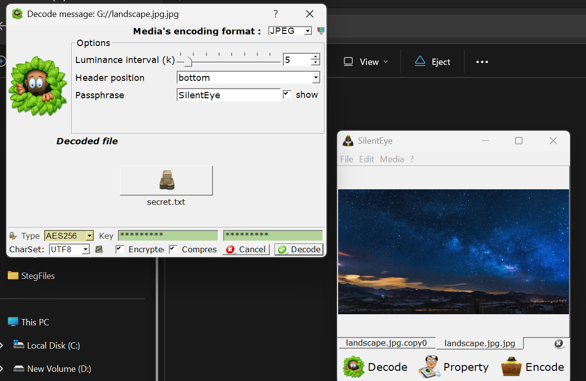
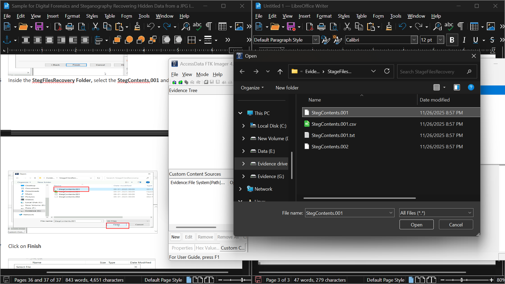
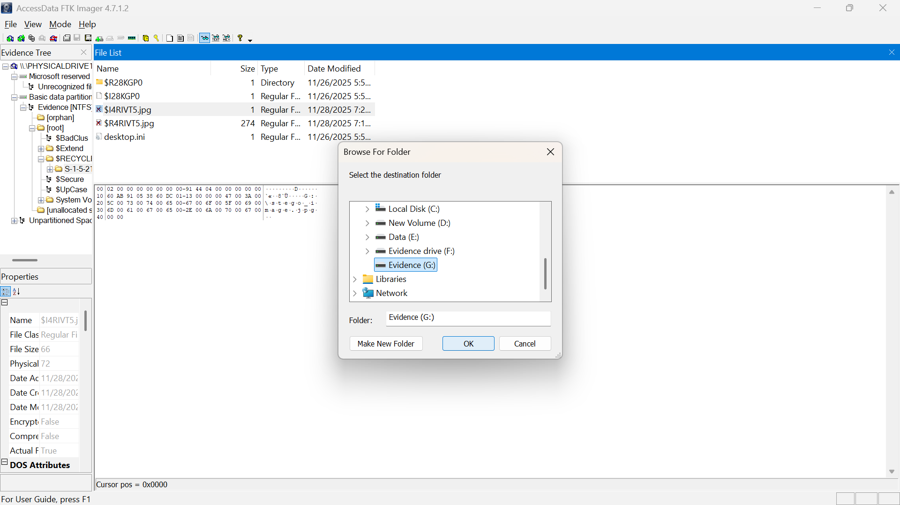

# 🔍 Digital Forensics & Steganography: Recovering Hidden Data from a JPG Image

## 📌 Objective
To demonstrate embedding hidden text inside a JPG image using steganography and recovering it through digital forensic techniques.

---

## 🧾 Project Description
This project simulates a real-world forensic investigation where hidden data is embedded inside an image file and later recovered after deletion.

The process involves:
- Embedding secret data into a JPG image using steganography
- Storing the file in a simulated disk environment
- Deleting the file to mimic data loss or concealment
- Recovering the file using forensic tools
- Extracting hidden data from the recovered image

---

## 🌍 Real-Time Scenario
A financial institution detects suspicious activity involving JPG files exchanged via email. These files disappear unexpectedly, raising concerns of a potential data breach.

During investigation:
- Deleted image files are recovered from storage
- A reconstructed JPG appears normal but contains hidden data
- Hidden content reveals potential security risks

This demonstrates how attackers may use steganography to hide sensitive information and how forensic teams respond.

---

## 🛠️ Tools & Technologies

- **Steganography Tools**: Steghide / SilentEye  
- **Forensic Tool**: FTK (Forensic Toolkit)  
- **File System**: NTFS (2GB partition)  
- **File Format**: JPG  
- **Environment**: Disk Image (2-disk system)

---

## 🔎 Methodology

1. Embed secret data into a JPG image using steganography tools  
2. Store the image in a simulated disk environment  
3. Delete the file to simulate a real-world incident  
4. Use FTK to recover the deleted file from disk image  
5. Extract hidden data from the recovered image  
6. Analyze findings and document results  

---

## 📊 Outcome

- Successfully recovered deleted JPG file  
- Extracted hidden data from image  
- Demonstrated forensic recovery techniques  
- Showcased risks of hidden data in common file formats  

---

## 🧠 Skills Gained

- Digital Forensics  
- Steganography  
- File Recovery Techniques  
- Disk Image Analysis  
- Metadata Investigation  

---

## 📁 Project Structure

digital-forensics-steganography/
│
├── README.md
├── sample-image.jpg
├── hidden-message.txt
└── screenshots/
├── steganography-encoding.png
├── ftk-evidence-loading.png
├── ftk-directory-listing.png

---

## 📸 Project Execution Screenshots   

### 🔹 Steganography Encoding Process

### 🔹 FTK Evidence Loading

### 🔹 Directory Listing

## ⚠️ Key Insight
Even normal-looking files like images can contain hidden sensitive data. Digital forensic tools play a critical role in identifying and recovering such concealed information.

